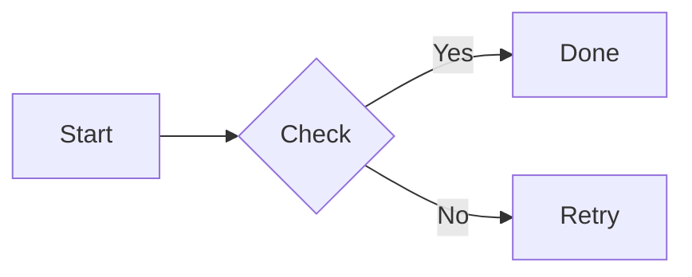
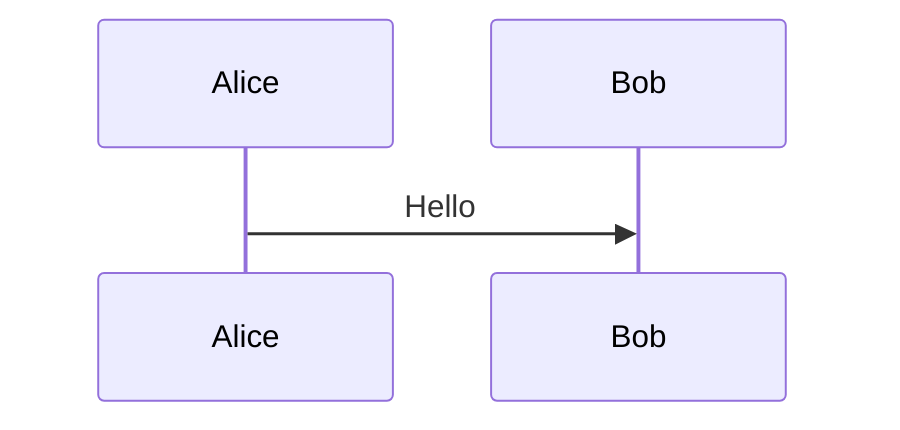
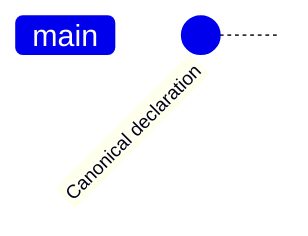
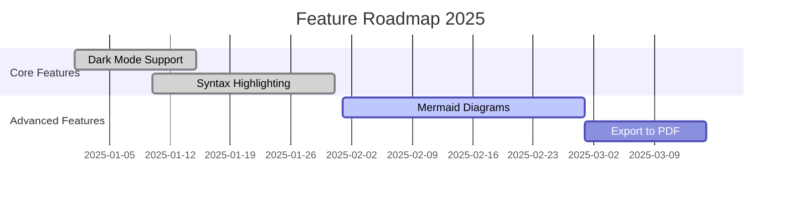
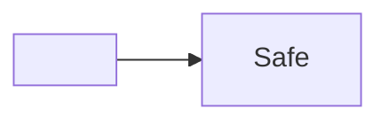

# Symmd Runtime Check

This document verifies **Monaco editing**, live Markdown preview, tables, code fences, and a local image.

## Table

| Check | Expected result |
| --- | --- |
| Editor | Monaco is visible and editable |
| Preview | Changes appear without reloading |
| Image | The green Symmd card appears below |

## Fenced code

```go
package main

import "fmt"

func main() {
	fmt.Println("Symmd runtime is healthy")
}
```

## Local image


## Mermaid





```mermaid
gitgraph
    commit id: "Initial commit"
    branch develop
    checkout develop
    commit id: " gitgraph"
```







```mermaid
not a valid diagram
```
